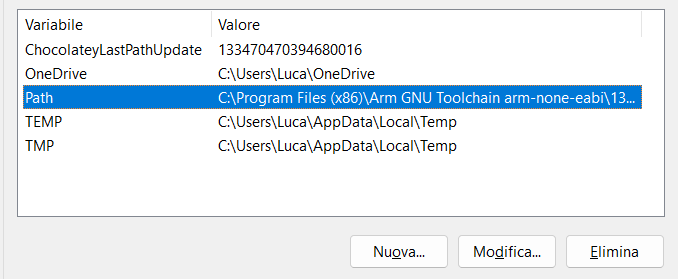
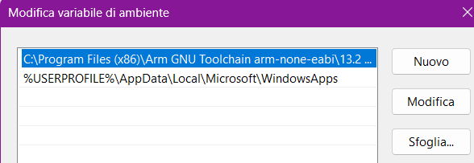
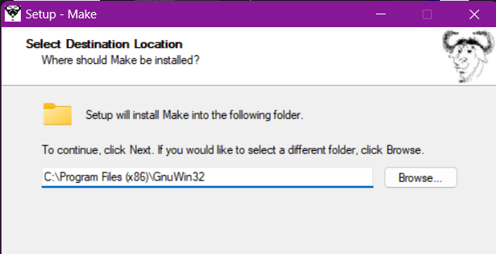

# Computer Architecture and Operating Systems

------------------------------------------------------------------------

# *Tutorial*
## *QEMU and FreeRTOS toolchain installation*

------------------------------------------------------------------------

- Gianfranco Trad
- Giorgio Fardo
- Luca Ponzo
- Michele Seira

Installation of the toolchain for FreeRTOS with WSL on Windows
==============================================================

Skip to the point if the installation is done on a **GNU/Linux** OS,
Adapt to the installed package manager.

Ubuntu installation
-------------------

The first step to install **FreeRTOS** on your device is to set up the
environment where it will run, and it can be done with:

        wsl --install Ubuntu-22.04

A message will appear, which will ask to insert a `username` (without
capital letter) and a `password` with a repetition of the same.

Setting up the required packages
--------------------------------

Using administrator privileges, you can add a new software repository to
the **APT** (`Advanced Package Tool`) system used for package management
in many `Debian`-based distributions, including `Ubuntu`. Specify the
repository address, which in this case refers to a **PPA**
(`Personal Package Archive`). **PPA**s are personal repositories that
may contain additional software not found in the official `Ubuntu`
repositories (to be verified; in this case, it pertains to updated
versions of `Python`).

        sudo add-apt-repository ppa:deadsnakes/ppa

Update the list of available packages from the software repositories
configured in the system:

        sudo apt update

Installing these packages provides the dependencies and libraries
necessary to compile and run various types of software on your system:

        sudo apt install git libglib2.0-dev libfdt-dev libpixman-1-dev zlib1g-dev ninja-build libncursesw5 libncurses5  python-is-python3 python3.8 build-essential libssl-dev zlib1g-dev libbz2-dev libreadline-dev libsqlite3-dev curl  libncursesw5-dev  xz-utils tk-dev libxml2-dev libxmlsec1-dev libffi-dev liblzma-dev 

Now download the file `get-pip.py` from the internet using the command:

        wget  https://bootstrap.pypa.io/get-pip.py

Finally, install **pip** on `Python`'s system:

        python get-pip.py

Compilation and install of Qemu from source
-------------------------------------------

Create **Qemu**'s directory:

        mkdir qemu

Go into the directory:

        cd qemu

Now, download the compressed archive containing the source code for
`version 8.2.0 Release Candidate 3` of **Qemu**, a processor emulator
and virtualizer:

        wget https://download.qemu.org/qemu-8.2.0-rc3.tar.xz

Decompress the recently installed repository:

        tar xvJf qemu-8.2.0-rc3.tar.xz

Navigate to the `qemu-8.2.0-rc3` folder:

        cd qemu-8.2.0-rc3

With this command, the configuration of the **Qemu**'s build process
takes place, specifically targeting the `arm-softmmu` and
`arm-linux-user` architecture:

        ./configure --target-list=arm-softmmu, arm-linux-user

Compiling using 6 different cores can be achieved as follows; in the
general case, check the system settings to determine the number of cores
your device has, where you are executing this tutorial.

        make -j6

Move the compiled files to the appropriate directories, creating links
in the correct system directories:

        sudo make install

After that, follow the below-mentioned path to enter the bin repository:

        cd  /usr/local/bin 

Verify the version of the compiled **ARM** architecture-based system
emulator from the previous steps:

        ./qemu-system-arm --version

        cd

ARM TOOLCHAIN
-------------

Create a variable **ARM\_TOOLCHAIN\_VERSION** and assign it the version
of the `ARM GNU Toolchain` extracted from the webpage
`https://developer.arm.com/downloads/-/arm-gnu-toolchain-downloads`:

        ARM_TOOLCHAIN_VERSION=$(curl -s https://developer.arm.com/downloads/-/arm-gnu-toolchain-downloads | grep -Po '<h4>Version \K.+(?=</h4>)')    

With this command, you will download the zip file `gcc-arm-none-eabi`,
which contains the version tied to the `bash` variable defined in the
previous command:

        curl -Lo gcc-arm-none-eabi.tar.xz https://developer.arm.com/-/media/Files/downloads/gnu/${ARM_TOOLCHAIN_VERSION}/binrel/arm-gnu-toolchain-${ARM_TOOLCHAIN_VERSION}-x86_64-arm-none-eabi.tar.xz

Create the directory:

        sudo mkdir /opt/gcc-arm-none-eabi

Now, with administrator privileges, extract the contents of the
`gcc-arm-none-eabi.tar.xz` archive and place it in the specified
directory:

        sudo tar xf gcc-arm-none-eabi.tar.xz --strip-components=1 -C /opt/gcc-arm-none-eabi

With this command, you add the specified path to the `PATH`, ensuring
that the **GNU ARM Toolchain** executables are globally available in the
system by appending a string to the specified file.

        echo 'export PATH=$PATH:/opt/gcc-arm-none-eabi/bin' | sudo tee -a /etc/profile.d/gcc-arm-none-eabi.sh

When you execute this command, the settings and environment variables
defined in the previous commands in \"`etc/profile`\" become immediate
and available in the current session.

        source /etc/profile

To check the version of **arm-none-eabi-gcc**

        arm-none-eabi-gcc  --version 

To check the version of **arm-none-eabi-gdb**

        arm-none-eabi-gdb --version 

FreeRTOS download
-----------------

To set the Git configuration \"`core.symlinks`\" to true, making Git
treat symbolic links as such:

        git config --global core.symlinks true 

The command used to clone an existing Git repository, in this case,
cloning the FreeRTOS repository from the **GitHub** site:

        git clone https://github.com/FreeRTOS/FreeRTOS.git --recurse-submodules

Debugger utilization
--------------------

Now navigate to the directory:

        cd FreeRTOS/FreeRTOS/Demo/CORTEX_MPS2_QEMU_IAR_GCC   

Enter to the file `main.c`

        nano main.c

Check if the variable in the file is set like below

        #define mainCREATE_SIMPLE_BLINKY_DEMO_ONLY      1

Exit from the file and go into this directory

        Cd build/gcc

Compilation as before

        Make -j6

This command starts a **QEMU** simulation of an **ARM Cortex-M3
system**, loads a specified kernel image, disables the graphical
interface, redirects serial output to the terminal, and pauses the
simulation, waiting for a debugger to connect.

        qemu-system-arm -machine mps2-an385 -cpu cortex-m3 -kernel ./output/RTOSDemo.out -monitor none -nographic -serial stdio -s -S

If you open another terminal to interact with the newly created virtual
machine and it gives you two options, such as the ability to continue
with \"pow\", you are likely interacting with a **QEMU monitor**.

        wsl 

        cd --

Enter to the output directory.

        cd  FreeRTOS/FreeRTOS/Demo/CORTEX_MPS2_QEMU_IAR_GCC/build/gcc/output

This command launches the **ARM** version of the `GNU Debugger (GDB)`
and loads the specific binary file ('`RTOSDemo.out`) for debugging.

        arm-none-eabi-gdb RTOSDemo.out

This command in **GDB** establishes a remote connection to a target
using the **GDB** Remote Serial Protocol. This is commonly used when
debugging a program running on a different machine.

        target remote localhost:1234

Installation of the toolchain for FreeRTOS natively on Windows
==============================================================

In the following steps there is a guide on how to setup **FreeRTOS** and
**QEMU** on windows and run a simple demo to ensure everything is
working. To go forward with the installation keep in mind that there are
different choices as an **SOC** to emulate, in this guide it is used an
**mps-an385**, meaning that it will be explained how to setup an ARM
debugger. If you want to install FreeRTOS and Qemu but decide to go with
another architecture please refer to [the official FreeRTOS
documentation](https://www.freertos.org/a00090.html).

QEMU
----

To download QEMU on windows refer to [the official QEMU
documentation](https://www.qemu.org/download/#windows) and download the
right executable for your OS architecture; after that just open the
executable, if it opens just skip chapter **2.1** (Command prompt
execution) and go for **2.2** (Standard execution).

### Command prompt execution

1.  open the command prompt as an administrator

2.  go to the directory of the QEMU installer

3.  type the name of the QEMU installer in the command prompt, it should
    open now

4.  go forward with the **Standard installation**

### Standard execution

Just press forward and keep in mind the location in which you decide to
install qemu, it will become handy sooner.

### Add to environment path

After the installation it's needed to add QEMU to the system PATH, you
can do it by searching \"environment variables\" and clicking on the
first result, when the window opens:

1.  search the item with the text PATH on the upper section of the
    window 

    

2.  click on edit

3.  add a new entry and put the path where qemu is installed (default is
    **C:\\Program Files\\qemu**)

    

4.  click ok on all the windows opened

MAKE
----

After QEMU we need some tools to build our FreeRTOS instance, in this
guide it will be used

        make

. Make can be downloaded [from this
source](https://gnuwin32.sourceforge.net/packages/make.htms), after
choosing the right OS you can start to download it.

Installation
------------

1.  follow the installation process, you can just keep forward, the only
    thing to remember is that you need to **save the installation
    path**.

    

2.  after the installation is concluded add make to the system PATH,
    just follow point **2.3** but change the directory to
    *make-dir*\\bin, as an example, if you install make in the same path
    as the image above you'll need to add to the PATH the directory
    **C:\\Program Files(x86)\\GnuWin32\\bin**,

3.  check that make is properly installed by typing

            make -v 

    on a command prompt window **freshly opened**, if the prompt gives
    an error make sure the PATH you set is correct and then try again.

ARM Toolchain
-------------

Since we are using an ARM SOC we'll need a matching compiler and
debugger, we can download them from [the official
website](https://developer.arm.com/downloads/-/arm-gnu-toolchain-downloads)

### Installation

As for the arm toolchain, life is easier, just keep sure to check the
box **Add path to environment variable** in the end, if you didn't,
you'll need to refer again to **2.3** and add *arm-toolachain-dir*\\bin
to the PATH manually.

FreeRTOS
--------

After having installed all the necessary tools we can download and
install FreeRTOS. First thing first we'll need to download the System,
in this case is a little more complex than before.

### Download

1.  open a command prompt and go in the folder you want to keep FreeRTOS

2.  enable git submodules by typing

            git config --global core.symlinks true

3.  clone the repository by typing

            git clone https://github.com/FreeRTOS/FreeRTOS.git --recurse submodules

### Installation

1.  go to
    ***FreeRTOS-dir*\\FreeRTOS\\Demo\\CORTEXMPS2QEMUIARGCC\\build\\gcc**

2.  type **make**

3.  if all the steps above went fine, you should have the file
    **.\\output\\RTOSDemo.out**

4.  if you want to run the blink demo, edit **.\\output\\main.o** and
    make sure the line **mainCREATESIMPLEBLINKYDEMOONLY** is defined to
    **1**.

    

### Starting FreeRTOS

If the installation procere is concluded, you should be able to run
FreeRTOS in QEMU by just typing one single command:

        qemu-system-arm -machine mps2-an385 -cpu cortex-m3 -kernel <FreeRTOS dir>\FreeRTOS\Demo\CORTEX_MPS2_QEMU_IAR_GCC\build\gcc\output\RTOSDemo.out -monitor stdio -s -S

### Debugger utilization

1.  open a new command prompt and go to the directory of RTOSDemo.out

2.  type the command

            arm-none-eabi-gdb RTOSDemo.out

3.  connect to the qemu instance, it should be opened in the default
    port: **1234**, you can do that by typing

            target remote localhost:1234

4.  if you type **continue** the blinky demo will start.
